# 2420 Week 12 Lab

## Team Members
- Stephen Patricio
- Uday Chhina

## Setup

For the setup, make a new droplet in Digital Ocean. Name this droplet `web-one`. This will be the hostname for the server. Make a regular user with sudo privileges, and make sure that root login is disabled. 

Before moving on, make sure that you are able to access this droplet through ssh for the regular user. 

---

## Installing NGINX

To install nginx, run: `sudo apt udpate` and `sudo apt install nginx`:

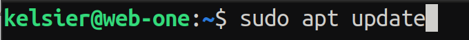

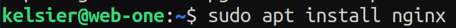

After you have installed nginx, you should run the following command to confirm that nginx has isntalled and the service is running: `systemctl status nginx`

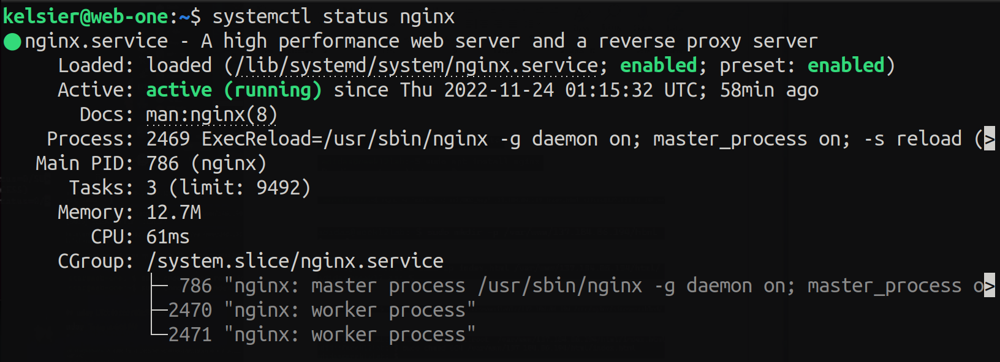

---

## Creating html and server block

This is the html file that will be served by nginx:

```html
<!DOCTYPE html>
<html lang="en">
<html>
<head>
    <meta charset="UTF-8" />
    <title>Lab 12 - 2420</title>
</head>
<body>
    <h1>Success!</h1>
    <h2 style="color: red;">Team members:</h2>
    <p>
        <ul>
            <li>Stephen Patricio</li>
            <li>Uday Chhina</li>
        </ul>
    </p>
    <p>
        This is a lab to make an nginx server. 
    </p>
</body>
</html>
```

The server block points to the html file that will be served by nginx. This is the server block:

```nginx
server {
        listen 80;
        listen [::]:80;

        root /var/www/146.190.34.125/html;
        index index.html;

        server_name 146.190.34.125;

        location / {
                try_files $uri $uri/ =404;
        }
}
```

---

## Moving the files to server

Now we will use rsync to copy the files to the server. Then we will move them to the correct locations and give them the correct permissions.

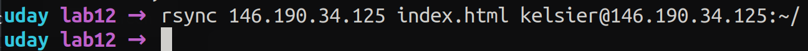

Move them to the correct location:

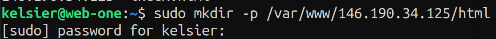

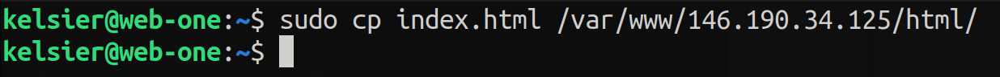

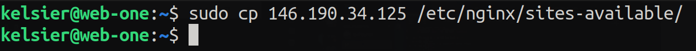

Make sure that the files have the correct permissions:

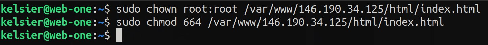

The next step is to make a symlink for the server block from the
`sites-available/` to `sites-enabled/` directories in order for nginx to
recognize which sites have been enabled out of the ones that are available.

Create the symlink:

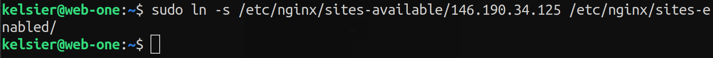

After you're done, reload the nginx service:

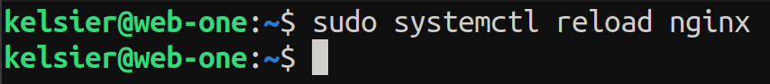

After this step, you should be able to access the website through the IP
address of the server: [146.190.34.125](http://146.190.34.125).


---

## Setting up UFW (Uncomplicated Firewall)

To set up UFW, run the following commands:

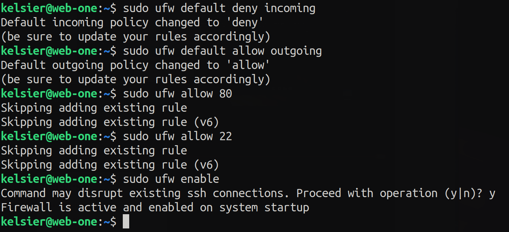

You can check the status of UFW by running `sudo ufw status`:

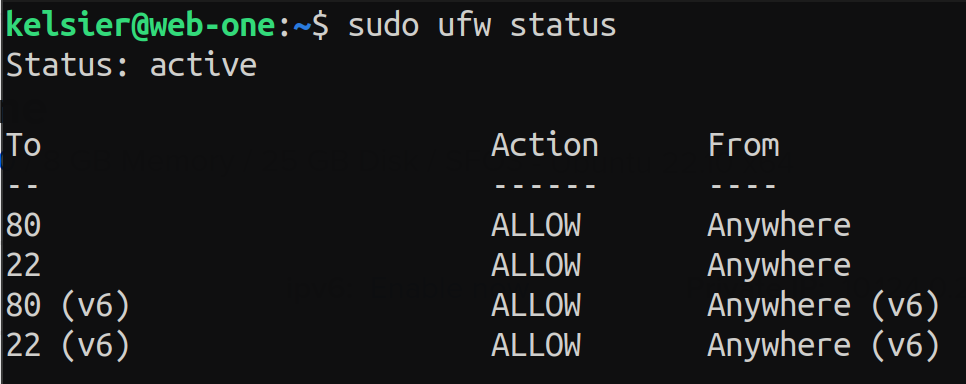

After setting up the firewall, you should be able to access the server through the browser and access it through ssh.

---

## Website

You can access the website at [Lab 12 - 2420](http://146.190.34.125)

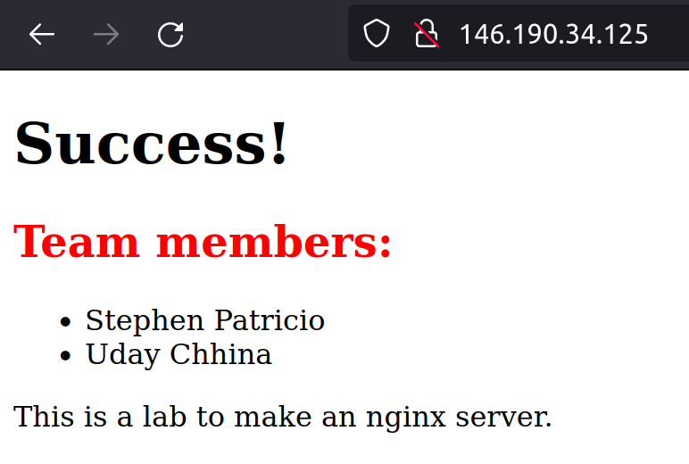